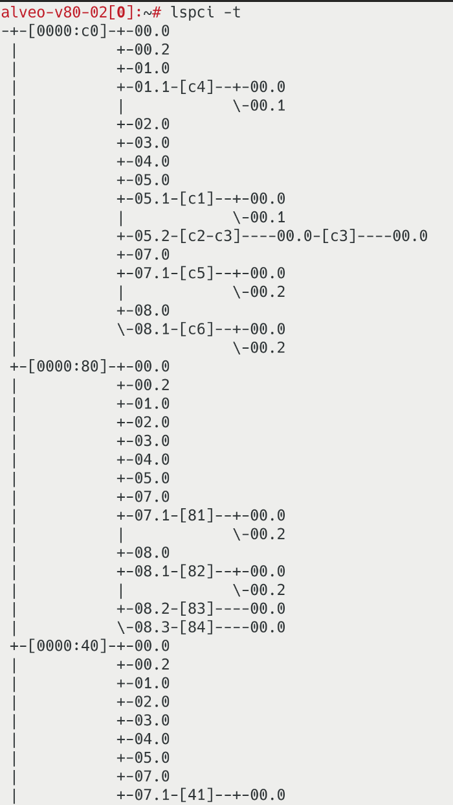

<div id="readme" class="Box-body readme blob js-code-block-container">
<article class="markdown-body entry-content p-3 p-md-6" itemprop="text">
<p align="right">
<a href="/?tab=readme-ov-file#--hacc-development">Back to top</a>
</p>

# CMDB Structure

The Configuration Management DataBase (CMDB) stores all information about the nodes in the cluster and the devices inside those nodes in a structure of text files. The CMDB is located in the `hdev/cli/cmdb/` directory and is structured as follows:

```
cmdb/
├── node-01.example.com/
│   ├── devices_acap_fpga
│   ├── devices_gpu
│   └── devices_network
├── node-02.example.com/
│   ├── devices_acap_fpga
│   ├── devices_gpu
│   └── devices_network
├── node-03.example.com/
│   ├── devices_acap_fpga
│   ├── devices_gpu
│   └── devices_network
└── < etc ... >
```

Each node is represented by a directory with the same name as the hostname of the node. Inside this node directory there are up to three text files, each representing a specific category of device.

### Device files

These files contain an entry per row for a particular device. A row has multiple attributes related to the entry, of which only the values are notated. The attribute is inferred from the location on the row. The values of attributes on each row are separated by a space. If an attribute can take a list, then the list items are separated by a forward slash '/'.

Below are the schemas of the three different device files:

#### devices\_acap\_fpga


The reconfigurable devices are PCIe add-on cards that provide a reconfigurable fabric. Hdev only supports AMD/Xilinx FPGAs at this moment.

There is one row per reconfigurable device, and the columns represent the following information:

```
<device index> <upstream bdf> <root bdf> <lnkctl> <device type> <device name> <serial number> <ip addresses> <mac addresses> <platform> <part>
```

| Attribute           | Type       | Description                                                                                                                                                          |
|---------------------|------------|----------------------------------------------------------------------------------------------------------------------------------------------------------------------|
| Device Index        | int        | Unique index of the device row. First row has index 1, the second has index 2, etc.                                                                                  |
| Upstream BDF        | string     | The PCI BDF of the Xilinx reconfigurable device. See [instructions below](#upstream-bdf).                                                                            |
| Root BDF            | string     | The PCI BDF of the port that the reconfigurable device is connected to. See [instructions below](#root-bdf).                                                         |
| LnkCtl              | hex        | The capabilities register address of the LinkCtl for the root bdf. See [instructions below](#lnkctl).                                                                |
| Device Type         | string     | Type of reconfigurable device. Choose between "acap", "asoc", or "fpga". See [instructions below](#device-type-for-reconfigurable-devices).                          |
| Device Name         | string     | Name of the device as reported by Vivado Hardware Manager.                                                                                                           |
| Serial Number       | string     | The Serial number of the device. See [instructions below](#serial-number).                                                                                           |
| IP Addresses        | list       | A list of IP addresses for the interfaces of the reconfigurable device. Use reserved IPs, dont' rely on DHCP for this type of device.                                |
| MAC Addresses       | list       | A list of MAC addresses of the interfaces of the reconfigurable device. List items correspond to the items in the IP list. See [instructions below](#mac-addresses). |
| Platform            | string     | The default platform (also called shell) that is loaded on the reconfigurable device. See [instructions below](#platform).                                           |
| Part Number         | string     | The part name of the reconfigurable device. See [instructions below](#part-number).                                                                                  |


#### devices\_gpu


The Graphics Processing Units (GPU) here are targeting AMD GPUs that use the rocm library.

There is one row per GPU, and the columns represent the following information:

```
<device index> <bus> <device type> <gpu id> <serial number> <unique id>
```

| Attribute           | Type       | Description                                                                                                                                   |
|---------------------|------------|-----------------------------------------------------------------------------------------------------------------------------------------------|
| Device Index        | int        | Unique index of the device row. First row has index 1, the second has index 2, etc.                                                           |
| Upstream BDF        | string     | The PCI BDF of the GPU. See [instructions below](#upstream-bdf).                                                                              |
| Device Type         | string     | Always set to "gpu".                                                                                                                          |
| GPU ID              | string     | The Device ID as denoted by `rocm-smi -i`.                                                                                                    |
| Serial Number       | string     | The Serial number of the device. See [instructions below](#serial-number).                                                                    |
| Unique ID           | string     | The Unique ID as provided by `rocm-smi --showuniqueid`.                                                                                       |


#### devices\_network


The network devices are the Network Interface Cards (NIC) that interface with a high-speed data network. Low-speed access and management connections should not be added here.

There is one row per networking device, and the columns represent the following information:

```
<device index> <bdf> <device type> <device name> <ip addresses> <mac addresses>
```

| Attribute           | Type       | Description                                                                                                                                                   |
|---------------------|------------|---------------------------------------------------------------------------------------------------------------------------------------------------------------|
| Device Index        | int        | Unique index of the device row. First row has index 1, the second has index 2, etc.                                                                           |
| Upstream BDF        | string     | The PCI BDF of the network device. See [instructions below](#upstream-bdf).                                                                                   |
| Device Type         | string     | Always set to "nic".                                                                                                                                          |
| Device Name         | string     | A representative string of your choosing that identifies the vendor or model of your NIC.                                                                     |
| IP Addresses        | list       | A list of IP addresses for the interfaces of the network device. It is expected in a data center setting, IP addresses are reserved or static.                |
| MAC Addresses       | list       | A list of MAC addresses of the interfaces of the network device. List items correspond to the items in the IP list. See [instructions below](#mac-addresses). |


How to find the ...
-------------------

#### Upstream BDF
BDF is an abbreviation of [Bus/Device/Function](https://en.wikipedia.org/wiki/PCI_configuration_space#Technical_information) and is the identifier for a certain PCIe device. The BDF follows a format of BB:DD.F, where BB, DD and F are hexadecimal numbers that represent the Bus, Device and Function respectively. We can find the BDF for our device using the `lspci` command. We can search in the lspci command for a Vendor or Model name that would identify our device. For example `lspci | grep Xilinx`, will most likely give us all BDFs for Xilinx devices.


In this example, we only have one V80 FPGA, but see two BDFs. As the Bus and Device are the same, we know this is the same FPGA device, that provides two functions. If this is the case for you always pick the BDF with Function 0 for the entry in the CMDB.

We can also search in lspci using a vendor ID, which may result in more reliable results. You will need to know the Vendor ID of your device, which you often can find using a search engine. You can also find it when you already know a device to be of that vendor, for example the Xilinx devices from before. We can get the Vendor ID using: `setpci -s c4:00.0 VENDOR_ID` (yes, confusingly the program is called `setpci`, but this specific command will only read). This will give us `10ee` for a Xilinx Device. So when we look for a Xilinx Device in the future we can also run (note the `:` at the end, this is important)
```bash
lspci -d 10ee:
```

Here is a table of Vendor IDs for a selection of vendors:

| Vendor           | Vendor ID |
|------------------|-----------|
| Xilinx           | 10ee:     |
| Broadcom         | 14e4:     |
| Mellanox         | 15b3:     |
| AMD motherboards | 1022:     |
| AMD GPUs         | 1002:     |

The tools that come with reconfigurable devices often also show the BDF of the devices, for example `xbutil examine` and `ami_tool overview`. Additionally for AMD GPUs you can also find the upstream BDF using `rocm-smi --showbus`.

#### Root BDF
The root BDF is the BDF of the device that the Upstream BDF is connected to. We can easily find this root BDF with
```bash
lspci -s <upstream bdf> -PP
```
The `-s <upstream bdf>` flag selects the device with the Upstream BDF (fill in the BDF that is relevant to you). The `-PP` flag will enhance the lspci output to also show the root BDF. The lspci will show this as `<root bdf>/<upstream bdf>`.


You can also see the whole structure of the PCIe connection tree using `lspci -t`. Which will show you something like:



We here see that under `0000:c0` there are multiple devices (the first `0000` represent the PCIe domain or PCIe segment, which most systems only have one of). So we see `[c4]` (the Bus of our Xilinx device) next to `01.1`, which is the Device and Function part of the root BDF. So when we construct this, the `c4:00.0` device is under the `c0.01.1` root BDF, which is also what we saw with the `lspci -s c4:00.0 -PP` command.

#### LnkCtl
The LnkCtl is the register address that has the controls over the link on the root bdf. We find this address by first showing the verbose lspci output of the root bdf.

```bash
lspci -s c0.01.1 -vv
```

We look for the section of `LnkCtl`. This is inside a `Capabilities` section and we look at the value that is in square brackets after this `Capabilities` header. In our example we see `[58]`, so we fill in `58` for the LnkCtl.

#### Device Type for reconfigurable devices
The Device type for the reconfigurable devices have three options: `acap`, `asoc` and `fpga`.

- Select `acap` for the [AMD Adaptive Compute Acceleration Platforms](https://docs.amd.com/r/en-US/am016-versal-cpm-ccix/Revision-History), such as the `AMD Versal VCK5000`.
- Select `asoc` for the [AMD Adaptive System on Chip](https://www.amd.com/en/products/accelerators/alveo/v80.html), such as the `AMD Versal V80`.
- Select `fpga` for all other AMD Alveo devices, such as the `AMD U55c`.


#### Serial number
You can often find the Serial number in the very verbose output of lspci using `lspci -vvv`. You will then find it after `[SN]`.

For reconfigurable devices, this method often does not work. Then you will use the provided tools to look this up. For devices using XRT use `xbmgmt examine` and for devices using AVED use `ami_tool overview`.

For AMD GPUs you can also use `rocm-smi --showserial` to find the serial number.


#### MAC Addresses

###### fpga and acap
For the FPGAs and ACAPs that use XRT, we can retrieve the MAC addresses using the following command
```bash
xbmgmt examine --device <bdf> -r platform
```

Note that using the `xbmgmt` command we need to use the `.0` function, whereas the user-space `xbutil` uses the `.1` function.

###### asoc
For the ASOCs that use AVED, we can retrieve the MAC addresses using the following command
```bash
ami_tool mfg_info -d <bdf>
```

###### network
To get the mac address of a network device, we can simply use a standard Linux command
```bash
ip a
```
Look for the network interface of your NIC and note down the mac address. If your NIC has multiple physical ports, then it will also most likely have multiple interfaces in the output of the `ip a` command. These interface names are often closely related and only increase a certain value in the name.

#### Platform
The platform is the shell that is installed on the FPGA/ASOC/ACAP.

For devices using XRT we can list all our devices and their platform using this command
```bash
xbutil examine
```

For devices using AVED, we can list all our devices and their platform using this command (TODO: probably, but still need to verify)
```bash
ami_tool overview
```

#### Part Number
TODO: unknown how to get this at the moment
