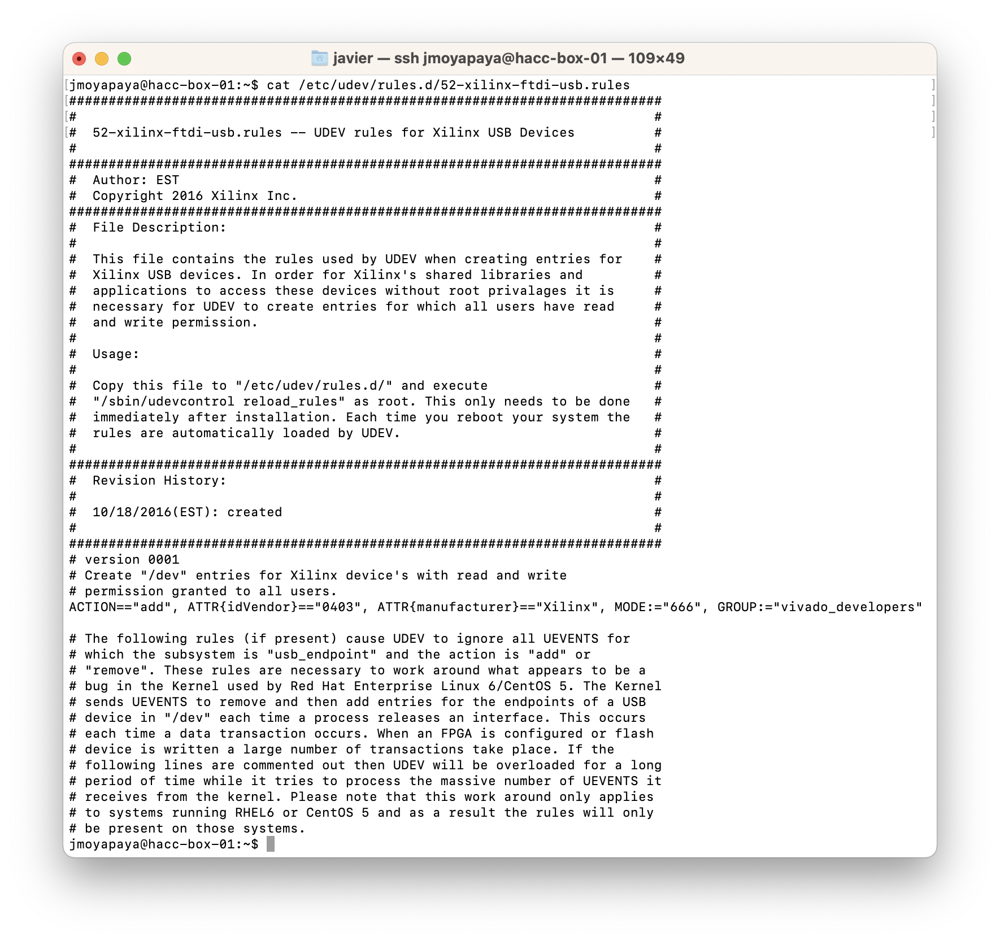
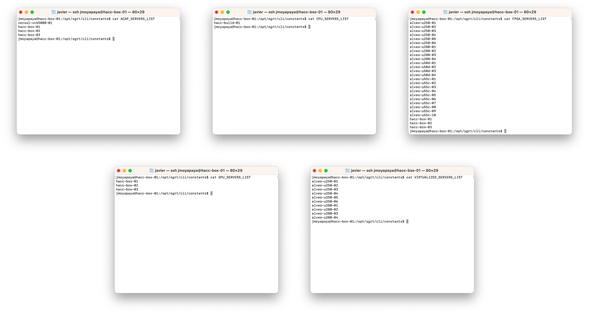

<div id="readme" class="Box-body readme blob js-code-block-container">
<article class="markdown-body entry-content p-3 p-md-6" itemprop="text">
<p align="right">
<a href="/?tab=readme-ov-file#--hacc-development">Back to top</a>
</p>

# Installation

To install **[hdev](https://github.com/fpgasystems/hdev)**, please proceed by following these steps:

* [Downloading the installer](#downloading-the-installer)
* [Running the installer](#running-the-installer)
* [Installing prerequisite software](#installing-prerequisite-software)
* [System and Vivado configuration](#system-and-vivado-configuration)
* [Generating device configuration files](#generating-device-configuration-files)
* [Enabling hdev on a cluster](#enabling-hdev-on-a-cluster)

## Downloading the installer
```
git clone https://github.com/fpgasystems/hdev_install.git
```

## Running the installer
Before running the installer, please ensure the following **prerequisites:**

* The user executing the installer possesses sudo capabilities.
* Confirm the existence of the `/tmp` folder on the targeted server, and ensure that both `$USER` and root have write permissions on it.

Once these prerequisites are confirmed, proceed with the installation:

```
sudo ./sgrt_install/run.sh
```

The first thing you need to do after running the installer is to provide a **non-existing path where you want to install hdev.** For example, designating `/opt` will install **hdev** in `/opt/hdev`. 

After that, the installer will continue asking server-related and tool path questions. The following information is intended to assist you in making the correct **path selections:**

<!-- There are 14 - SERVER_LIST = 14 - 4 = 10 variables with dialogs as in run.sh -->
* **AVED_PATH:** This parameter designates the path to a valid AVED (Alveo Versal Example Design) xbtest installation, installed by default at `/opt/amd/aved`.
* **AVED_TOOLS_PATH:** This field specifies the path to the command line tool for the AMI driver API (ami_tool) installed on the server. The default value is established as `/usr/local/bin`.
* **LOCAL_PATH:** This parameter designates a directory where the user (`$USER`) must have the required privileges to conduct read, write, and application execution operations. By default, this path is configured as `/local/home/$USER`.
* **MY_DRIVERS_PATH:** This parameter specifies a directory where the user (`$USER`) should possess the necessary permissions to employ the `rmmod` and `insmod` system calls. By default, this path is configured as `/tmp/devices_acap_fpga_drivers` (where inserted driver files would be removed after a server reboot).
* **MY_PROJECTS_PATH:** This parameter designates a directory where the user (`$USER`) must have the required privileges to conduct read, write, and application execution operations. The default setting is `/home/$USER/my_projects`, where `/home/$USER` typically corresponds to an NFS hard drive accessible from all servers within a cluster.
* **GITHUB_CLI_PATH:** This field specifies the path to a valid GitHub CLI installation, with the default location set at `/usr/bin`.
* **ROCM_PATH:** This field specifies the path to a valid ROCm installation, with the default location set at `/opt/rocm`.
* **UPDATES_PATH:** This parameter designates a directory where sudo users have the required privileges to conduct read, write, and application execution operations. By default, this path is configured as `/tmp`.
* **XILINX_PLATFORMS_PATH:** This parameter designates the path to the Xilinx platforms installed on the server. The default value is configured as `/opt/xilinx/platforms`.
* **XILINX_TOOLS_PATH:** This field specifies the path to the Xilinx tools (Vivado, Vitis, Vitis\_HLS) installed on the server. The default value is established as `/tools/Xilinx/`.
* **XILINXD_LICENSE_FILE:** A list of verified license servers for Xilinx tools.
* **XRT_PATH:** This parameter designates the path to a valid Xilinx RunTime installation, with the default setting positioned at `/opt/xilinx/xrt`.

Please note that you have the flexibility to utilize any other environment variable distinct from `$USER` to define your paths.

## Installing prerequisite software

To ensure proper functionality, the following tools must be present on the server for **hdev** to run:

### Xilinx tools and deployment target platforms
For those servers with reconfigurable devices, the following criteria apply:

* **XRT (Xilinx RunTime):** To ensure proper operation, a valid XRT version must be present in the designated `XRT_PATH`. 
* **Vivado and Vitis_HLS:**  In order to run **hdev** effectively, it is mandatory to have valid versions of Vivado and Vitis_HLS installed within the specified `XILINX_TOOLS_PATH`.
* **Vitis:** The inclusion of the Vitis Development Core is optional but can be beneficial. If you choose to install it, please ensure that it is also placed within the `XILINX_TOOLS_PATH` directory for seamless integration.

Finally, as a vital requirement, all the Xilinx accelerator cards mounted on the deployment server must have their **deployment target platform toolkit** available within the designated `XILINX_PLATFORMS_PATH` directory.

### HIP and ROCm tools
For servers equipped with GPUs, a valid HIP/ROCm release must be present in the designated `ROCM_PATH` directory.

### Other tools
Besides the tools listed above, the following are also required to make **hdev** fully operative: <!-- This should match the PACKAGES vector in run.sh -->

* curl
* [GitHub CLI](https://cli.github.com) 
* jq
* python3
* uncrustify
<!-- * iperf
* [MPICH](https://www.mpich.org) -->

## System and Vivado configuration

The user groups **all_users** and **vivado_developers** should be added to `/etc/sudoers.d`:

```
ALL ALL=NOPASSWD:$CLI_PATH/common/get_booking_system_servers_list,$CLI_PATH/program/vitis,$CLI_PATH/program/revert
```
*all_users group contents.*

```
vivado_developers ALL=(ALL) NOPASSWD:/sbin/reboot,/sbin/insmod,/sbin/rmmod,/sbin/iptables,$CLI_PATH/program/fpga_chmod,$CLI_PATH/program/pci_hot_plug,$CLI_PATH/program/vivado,$CLI_PATH/program/rescan,/usr/sbin/modprobe,$CLI_PATH/set/write
```
*vivado_developer group contents.*

where `$CLI_PATH` represents **hdev** CLI path, for example `/opt/hdev/cli` and **must be declared as environmental variable.**

### Vivado configuration
In order to use the **Vivado workflow, hdev** requires to **install cable drivers** for Xilinx boards and **configure udev rules.**

1. **Install cable drivers:** 
```
cd $XILINX_VIVADO/data/xicom/cable_drivers/lin64/install_script/install_drivers/
./install_drivers
```
where `$XILINX_VIVADO` is an environment variable related to `XILINX_TOOLS_PATH`.

2. **Configure udev rules:** 
```
sudo sed -i '/^ACTION=="add", ATTR{idVendor}=="0403", ATTR{manufacturer}=="Xilinx"/c ACTION=="add", ATTR{idVendor}=="0403", ATTR{manufacturer}=="Xilinx", MODE:="666", GROUP:="vivado_developers"' /etc/udev/rules.d/52-xilinx-ftdi-usb.rules
```
where the **vivado_developers** group relates to the section above.


*Installing cable drivers and configuring udev rules.*

## Configuring the devices Configuration Management Data Base
The Configuration Management Data Base (CMDB) stores all related info of the devices in each of the nodes in the cluster. See the [documentation of the CMDB](./docs/cmdb-structure.md) to understand how to set this up.

## Enabling hdev on a cluster
Under the following assumptions, **hdev** can program bitstreams on remote servers’ ACAPs and FPGAs:

1. **hdev** is successfully installed on all the servers you wish to include in your managed cluster.
2. The remote servers are on the same IP network.
3. You have the necessary SSH access permissions to interact with the remote servers.
4. All target servers have replicated copies of the five SERVERS_LIST files, which are located in the `$CLI_PATH/constants` directory. **To illustrate, here's an example of such files in a real hdev cluster:**


*The files ACAP_SERVERS_LIST, BUILD_SERVERS_LIST, FPGA_SERVERS_LIST, GPU_SERVERS_LIST, and VIRTUALISED_SERVERS_LIST are replicated on all servers in the cluster.*

For larger clusters with a significant amount of servers, consider using infrastructure automation platforms for [System and Vivado configuration](#system-and-vivado-configuration) and [Generating device configuration files](#generating-device-configuration-files). As mentioned in [Operating the cluster](https://github.com/fpgasystems/hacc/blob/main/docs/operating-the-cluster.md#operating-the-cluster), ETHZ-HACC is using Ansible.

<!-- # License

[](https://opensource.org/licenses/MIT)
