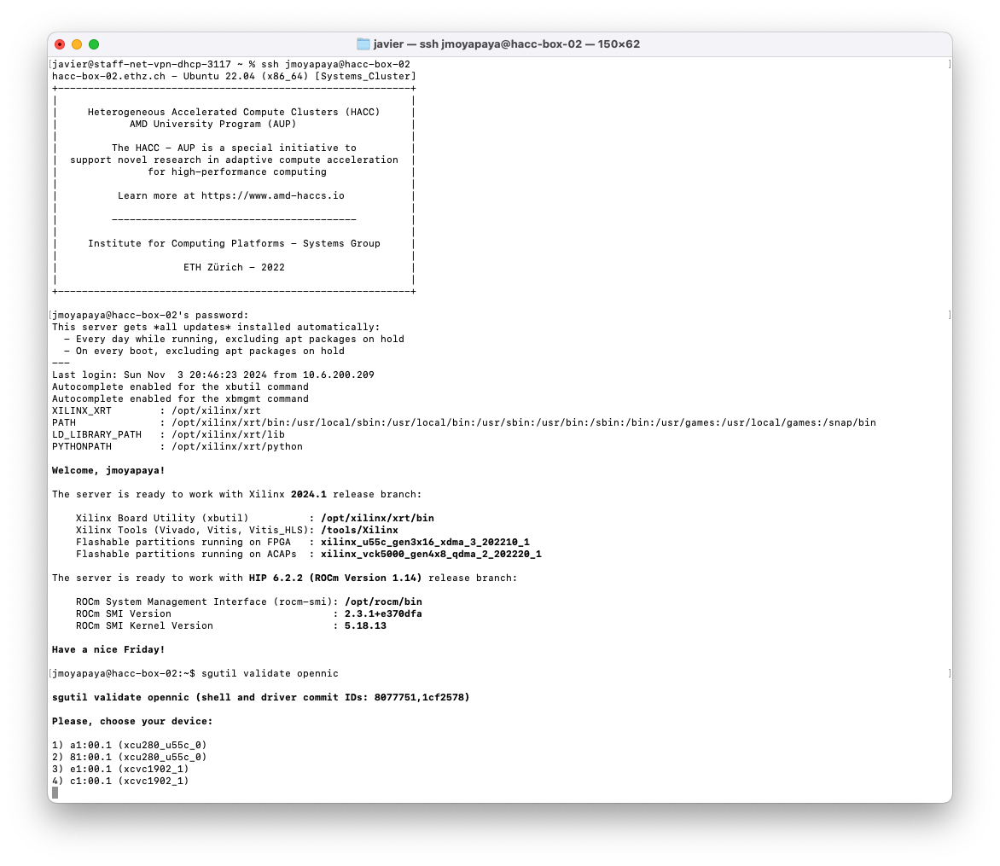

<article class="markdown-body entry-content p-3 p-md-6" itemprop="text">

<a href="https://github.com/fpgasystems/hdev/#--hacc-development">Back to top</a>

# Features

By using **hdev,** you can easily:

* **Validate the fundamental functionality** of your cluster, ensuring its reliability and performance.
* Expedite project creation through intuitive multiple-choice dialogs and templates, **streamlining the development of your accelerated applications.**
* Seamlessly integrate with [GitHub CLI](https://cli.github.com) for efficient **version control and collaboration.**
* Effectively manage ASOCs, FPGAs, multi-core CPUs, and GPUs, **all through a unified device index.**
* **Design, build, and deploy modern accelerated applications with ease,** leveraging your own or third-party integrations.
<!-- * **Transition between Vivado and Vitis workflows effortlessly,** eliminating the need for system reboots and enhancing your development agility. -->
<!-- * Explore model-based design principles with readily available ***out-of-the-box* examples.**
* **Simplify the creation of HIP/ROCm GPU applications** using the *sgutil new-build-run hip* commands. -->

*Validating ETHZ-HACC with **hdev.***

<!-- This should be consistent with features on the HACC repository -->